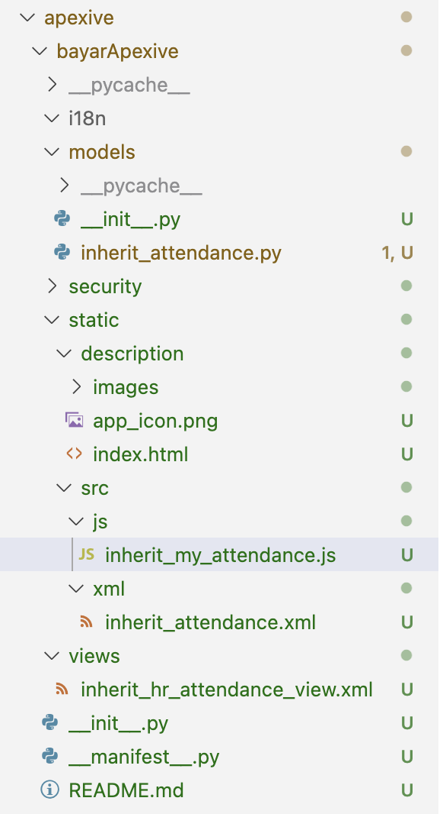
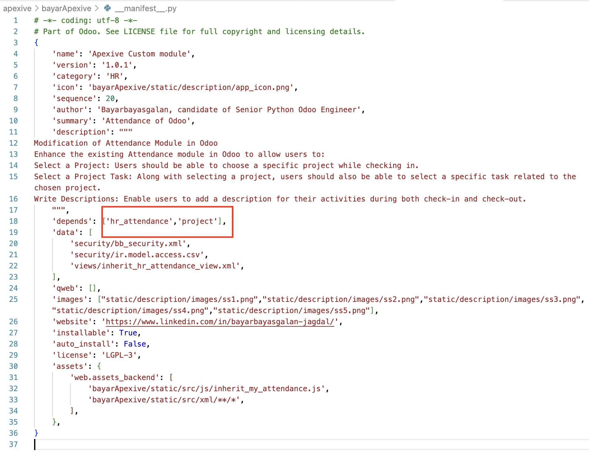
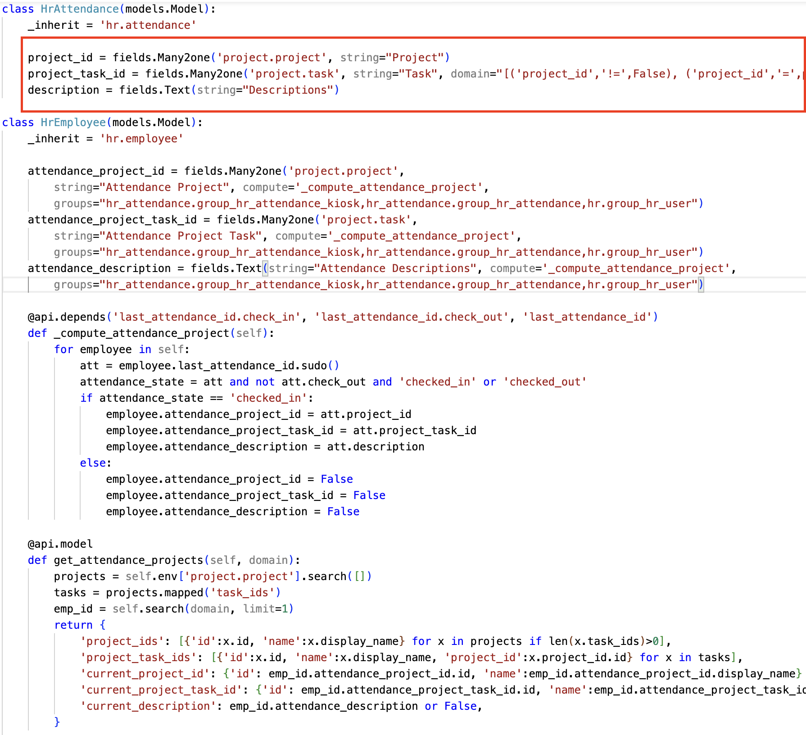
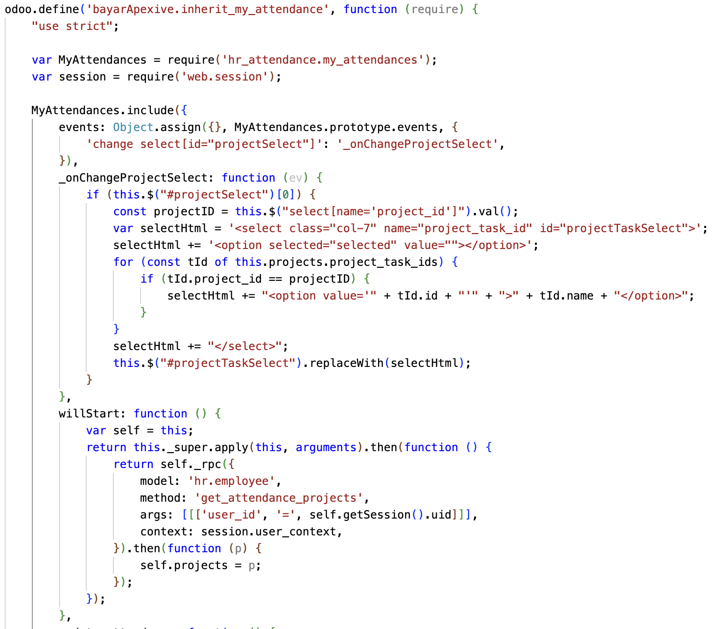
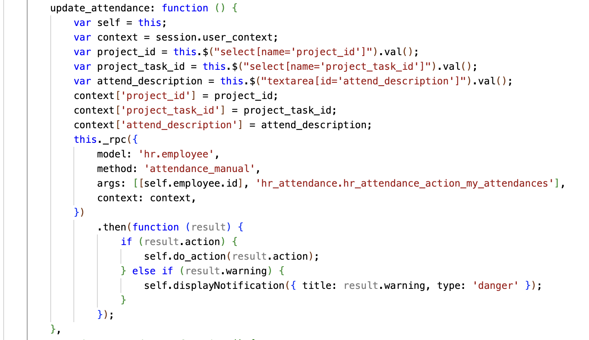
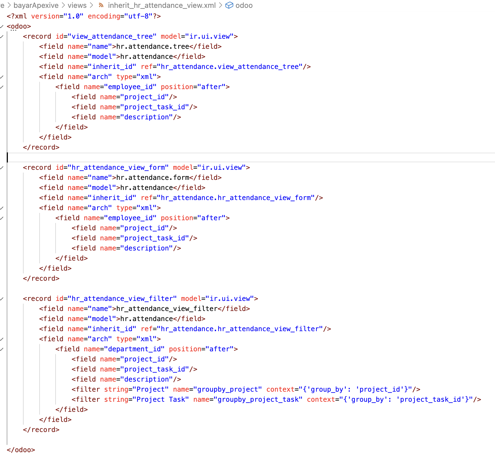
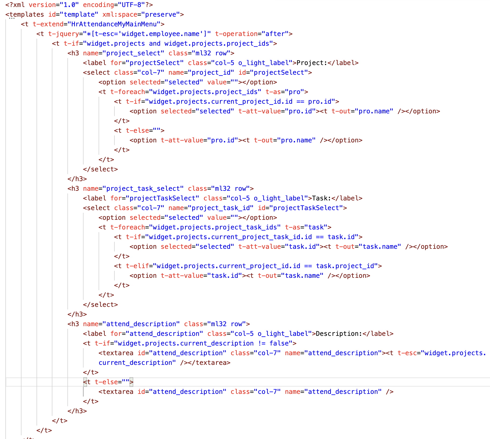
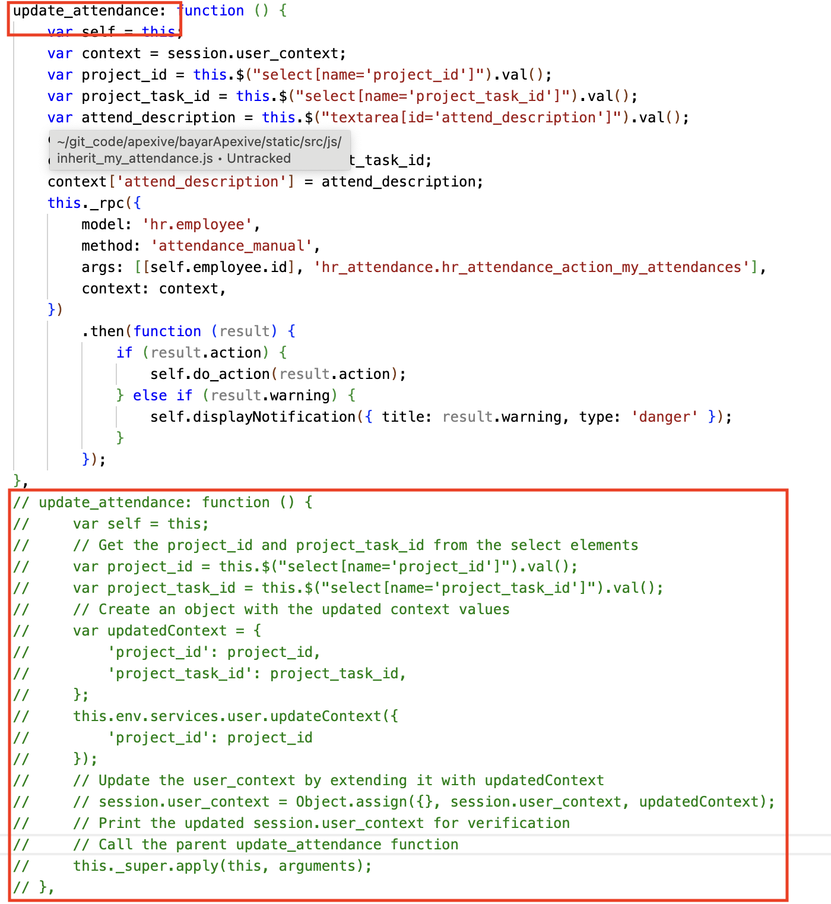

# Bayar Modification of Attendance Module in Odoo for Apexive
# Code structure
# 1. This is main code structure

# 2. This module's dependency modules

# 3. Python codes. All code is inherited from parent Module.

# 4. Javascript codes.

# 5. XML codes.

# 6. Just only one function overrided!!. I tried many times without overriding. But it was impossible.
